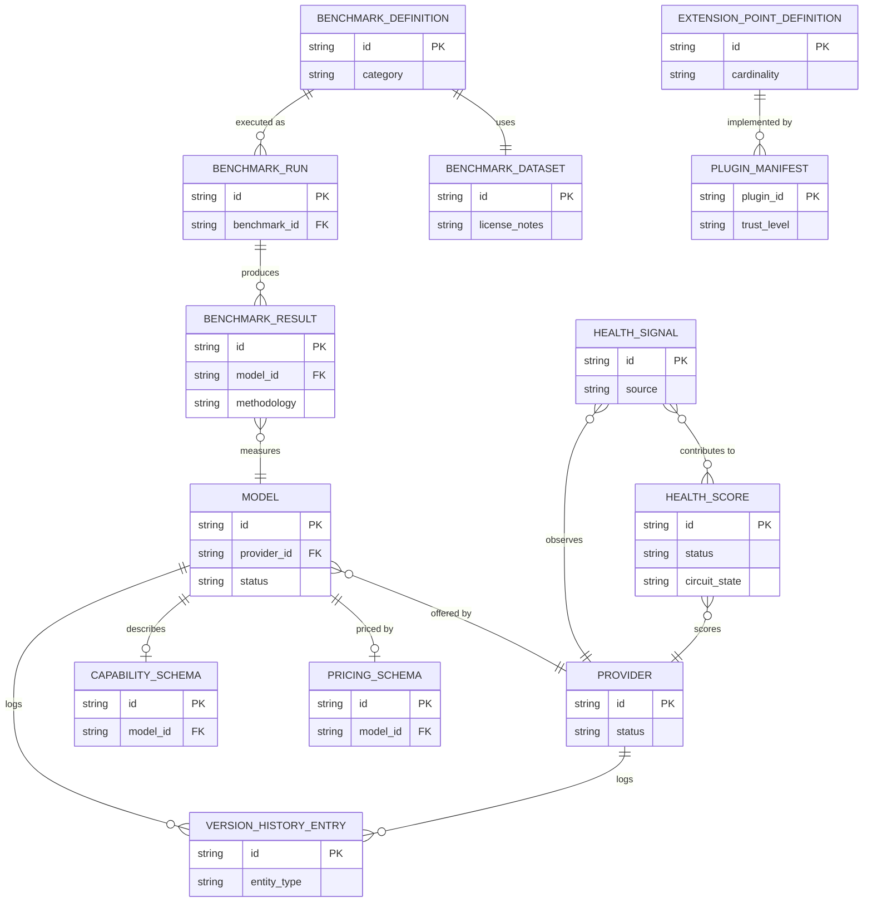
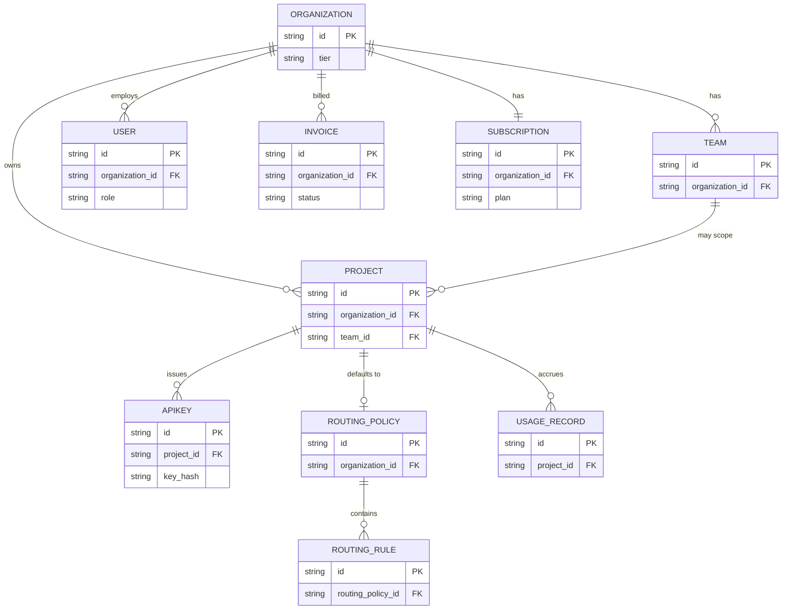

# Entity-Relationship Diagrams

Two diagrams, not one — the full system spans two clusters loosely connected through `Model`/`Organization`, and one combined diagram of all ~37 entities would be unreadable. Both render in any mermaid-compatible viewer.

## Core platform: Provider, Model, Benchmark, Health, Plugins

## Identity, tenancy, routing, billing

**The bridge between the two diagrams**: `UsageRecord.model_id → Model.id` and `RoutingHistory.winning_model_id → Model.id` (see `relationships.md`) — every tenant-scoped request ultimately resolves to a core-platform `Model`, which is why the two clusters are diagrammed separately but aren't actually independent.
